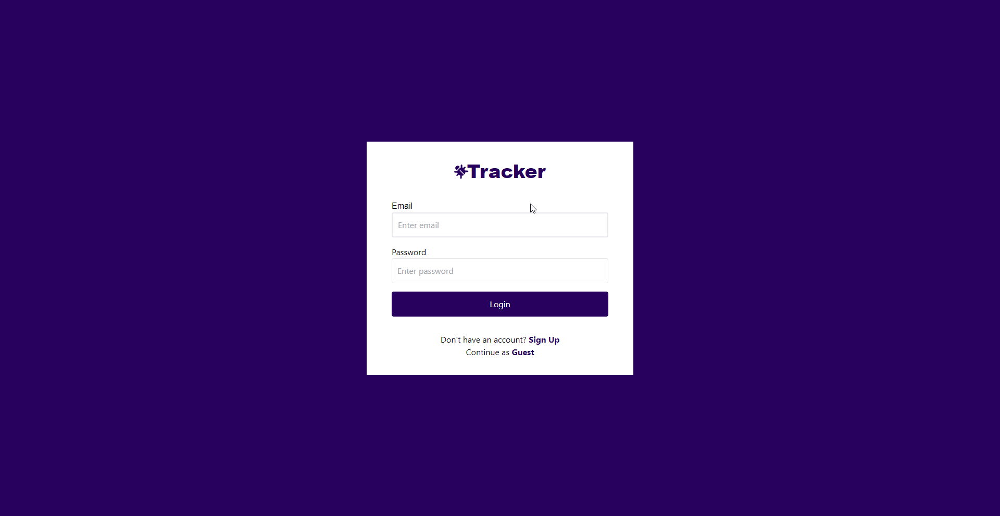
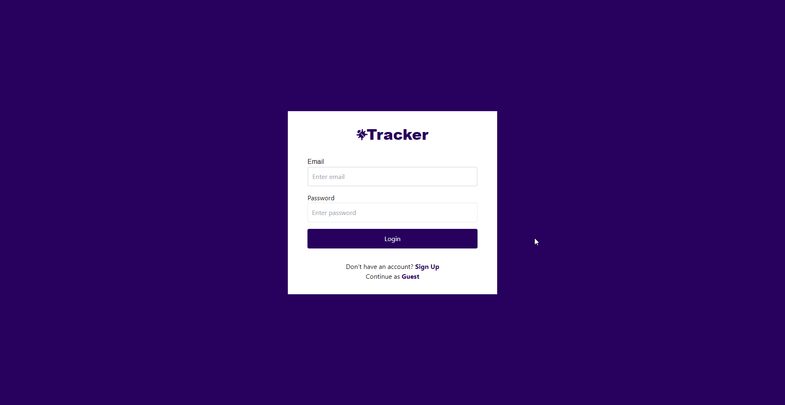

# Issue Tracker
## A web application for tracking developers, issues, and new features on a project. 
### Overview
The *Issue Tracker* was designed to help with tracking issues and features on new projects. New user's are able to sign up and select from the roles  administrator, project lead, or developer. User's are also able to sign in with guest accounts with the aforementioned roles. 
Administrators are able to create new projects and assign a project lead and developers to the project. With projects, users are able to see an overview of the project and suggest new features or list bugs with the ticket feature. 

### How to Use
To get started, a new user would need to either create an account, login with an existing account, 

use one of the three guest account options: developer, project lead, or administrator, 

or alternatively sign up as a new user. 

